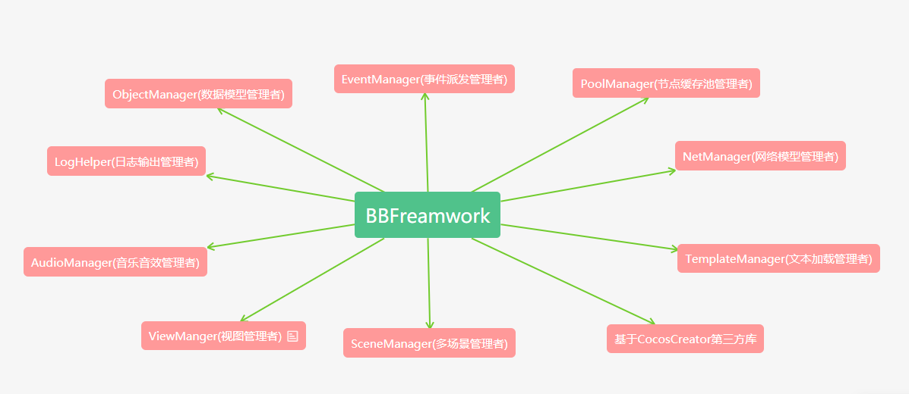

# BBFramework(让游戏开发变得更简单)

BBFreamework是针对使用CocosCreator开发的一套休闲游戏框架，适用于中小型项目使用。BBFreamework可以帮助开发者组织代码，以及业务结构，让项目更好维护和拓展，提高开发效率。

## 简略架构图
BBFramework一共分为10大模块
- 视图管理者(ViewManager)
- 音乐音效管理者(AudioManager)
- 日志管理者(LogHelper)
- 数据模型管理者(ObjectManager)
- 事件派发管理者(EventManager)
- 节点缓存池管理者(PoolManager)
- 网络模型管理者(NetManager)
- 多场景管理者(SceneManager)
- 文本加载管理者(TemplateManager)
- 基于CocosCreator的功能库



## 暂时屏蔽功能(需要完善的功能)

- 网络模型管理者(NetManager)
- 文本加载管理者(TemplateManager)
- 基于CocosCreator的功能库

## 如何使用 BBFreamwork 

BBFreamwork 提供的UI框架全部在bb命名空间下,例如日志输出

```typescripts

// 日志输出
bb.log("hello world!!");
bb.info("hello world!!");
bb.logW("hello world!!");
bb.logE("hello world!!");

```
如何加载一个界面

```typescripts
 bb.ViewManager.showView(name: string,  prefab: cc.Prefab, data: any): bb.ViewCtrl 
```


## 展望未来

目前 BBFreamwork 框架还有些不足，也欢迎更多开发者反馈问题，后期会不断的完善 BBFreamwork 框架并提供一些基于CocosCreator的功能库，提供一些更多的 Demo，如果你有使用 BBFreamwork 框架开发的作品并且有一点的想法欢迎你通过微信公众号联系作者。

## 

关注微信公众号【游戏讲坛】，会分享游戏全栈开发中的疑难杂症

